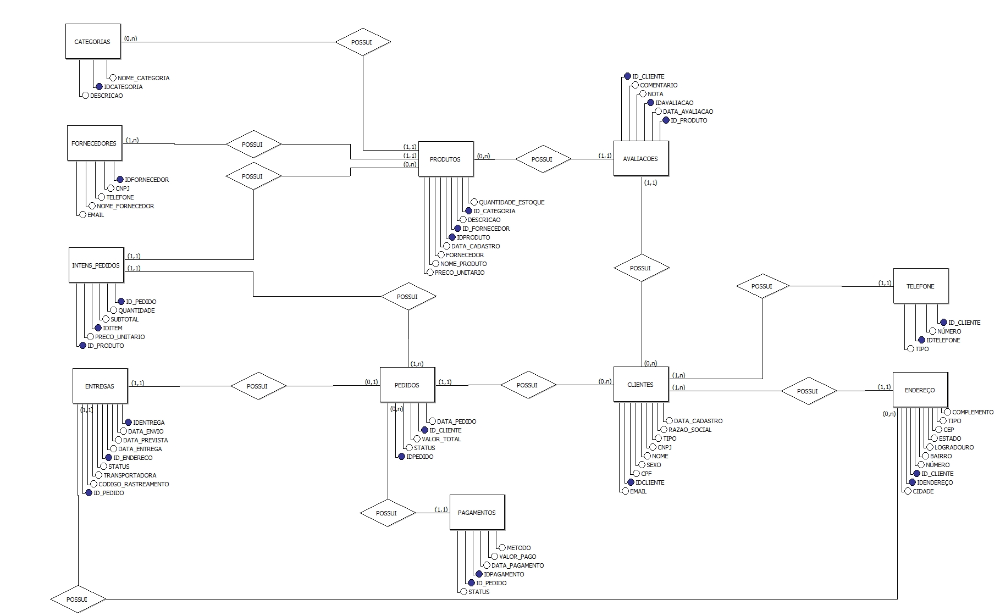

# 🏪 Banco de Dados para E-commerce

Um sistema completo de banco de dados MySQL para e-commerce com dados sintéticos gerados via Python.

## 📊 Visão Geral do Projeto

Solução completa de banco de dados para e-commerce com *12 tabelas normalizadas*, contendo:

|    Módulo   |           Funcionalidades            |      Volume de Dados       |
|-------------|--------------------------------------|----------------------------|
| *Cadastro*  | Clientes PF/PJ, endereços, telefones | ~1.400 clientes            |
| *Catálogo*  | Produtos, categorias, fornecedores   | 42 produtos / 7 categorias |
| *Vendas*    | Pedidos, itens, pagamentos           | Dados massivos de vendas   |
| *Logística* | Entregas, rastreamento               | Dados completos de entrega |
| *Pós-venda* | Avaliações, histórico                | Sistema de feedback        |

## Diagrama de Entidade-Relacionamento do Banco:

## 🎯 Destaques Técnicos

### Geração de Dados Sintéticos
- Dados criados via script Python com biblioteca Faker
- Informações realisticamente distribuídas (nomes, emails, endereços brasileiros)
- Relacionamentos consistentes entre tabelas

## 🛠 *Tecnologias Utilizadas*

|      Camada      |          Tecnologias          |
|------------------|-------------------------------|
| *Banco de Dados* | MySQL 8.0+                    |
| *Linguagem*      | Python 3.8+                   |
| *Bibliotecas*    | Faker, mysql-connector-python |
| *Ferramentas*    | DrawSQL (Diagrama ER)         |

### Análises Business Intelligence
- 10 consultas SQL analíticas prontas
- Métricas de vendas, ticket médio, conversão
- Análise de performance e comportamento de clientes

## 👩🏻💻 Autor
**Ádyla Iasmin Barbosa da Silva**  
📧 [Email](adylaiasmim811@gmail.com)  
🔗 [LinkedIn](www.linkedin.com/in/ádyla-iasmin-b-67a393232)
